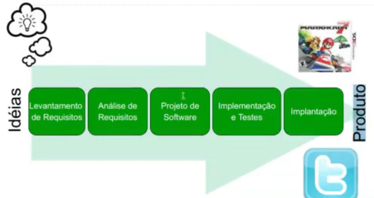
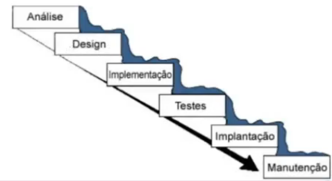
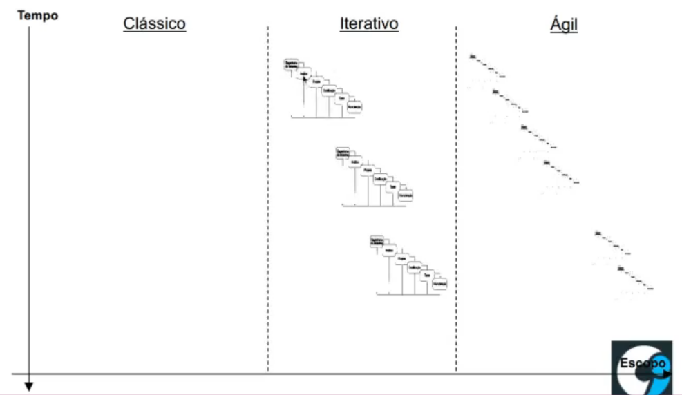

# software-design-methods

* Software Engineering is a technology based on 3 layers: processes, methods and tools. And the basis to all these layers is the focus on the software quality.

* Focus on the creation and the evolvement of the softwares

## Processo de desenvolvimento

* Compreende as atividades necessárias para definir, desenvolver, testar e manter um produto (sistema de software).

* Alguns objetivos do Processo de Desenvolvimento de Software:
    * Definir quais as atividades a serem executadas ao longo do projeto
    * Qunado, como e por quem tais atividades serão executadas
    * Prover pontos de controle para verificar o andamento do projeto
    * Padronizar a forma de desenvolver software em uma organização

* Atividades Típicas de PDSW

## Metodologias Tradicionais

### Cascata

* Modelo antigo e mais utilizado antigamente
* Caracterizado por uma abordagem sequencial para o desenvolvimento de software
* Cada atividade é uma fase distinta. Só após o seu total término é que a próxima atividade começa

### RUP (Rational Unified Process)

* Herda muita coisa do cascata.

### Metodologia Ágil

* Vem pra mostrar que em certos casos, uma metodologia geral como o RUP não era adequada
* A maioria dos métodos ágeis tenta minimizar o risco pelo desenvolvimento do software em curtos períodos (iteração)
* Entre 1 e até 4 semandas (no máximo 4 meses)
* iteração = processo de software em miniatura
* Etapas: Planejamento, análise de requisitos, projeto, codificação, teste e documentação.

* Processo convencional, cada iteração não está necessariamente ofcada em adicionar um novo conjunto significativo de funcionalidades.
* Porjeto de software ágil busca a capacidade de implantar uma nova versão do software ao fim de cada iteração
* Desenvolvimento ágil enfatiza a comunicação face-a-face, por isso produzem pouca documentação em relação a outros métoods, sendo este um dos seus pontos diferenciais.
* Eliminam grande parte do excesso de modelos e de documentação e o tempo gasto nestas tarefas
* Enfatizam um desenvolvimento de aplicação simples e iterativo.
* **Exemplos** : 
    * Extreme Programming (1996)
    * DSDM (Métood de desenvolvimento de sistemas dinâmicos) (1995)
    * Crystal (2004)
    * Scrum (1986)

### Comparação (Cascata, RUP, Ágil)

* No clássico se tem apenas um único ciclo grande.
* No RUP temos ciclos menores distribuídos (iterações)
* No ágil as iterações são bem pequenas
  

